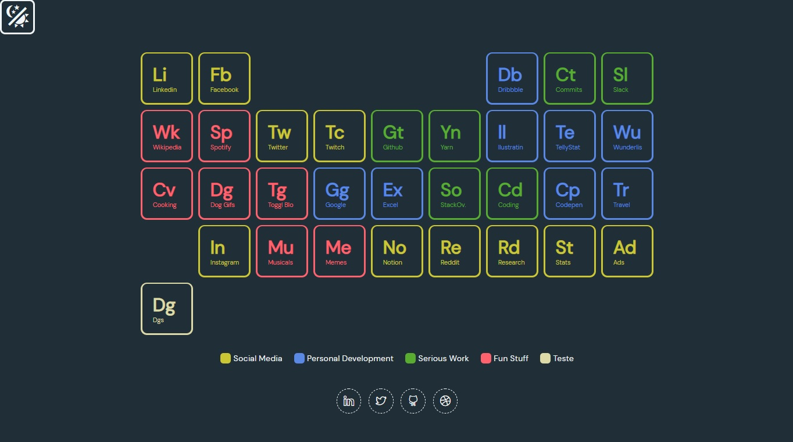
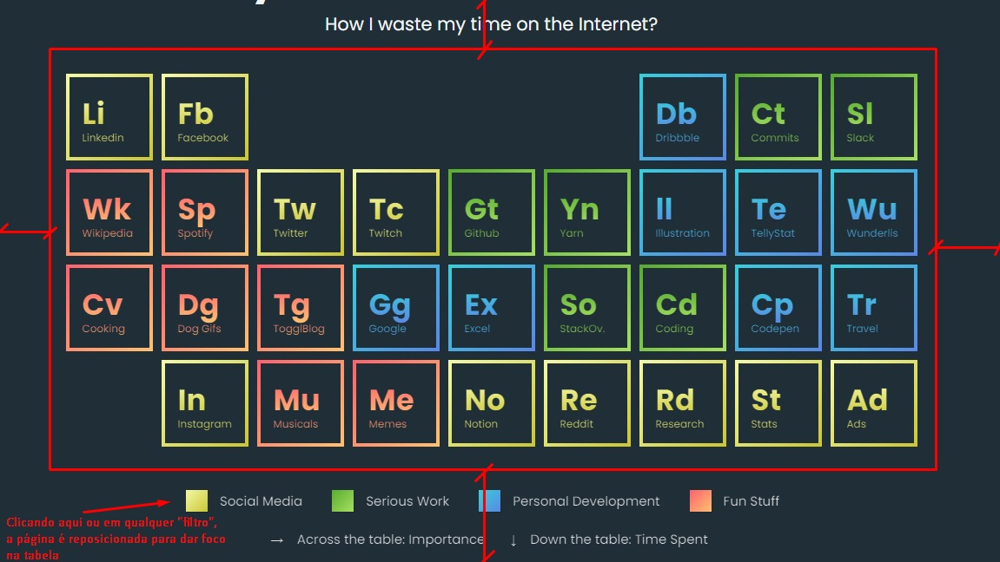
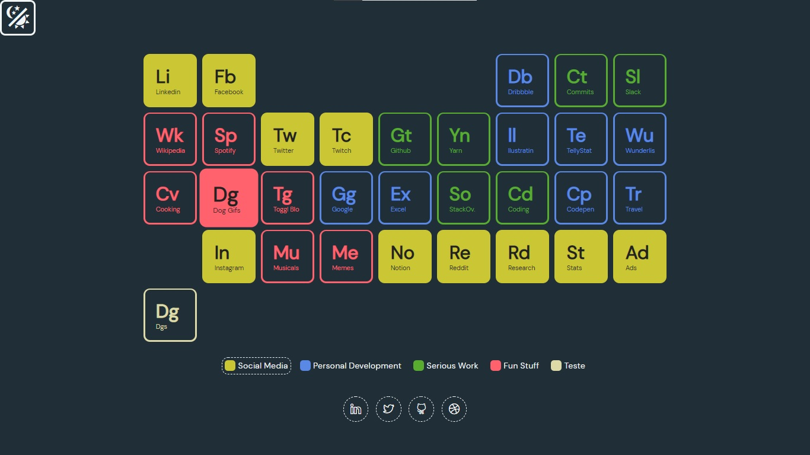
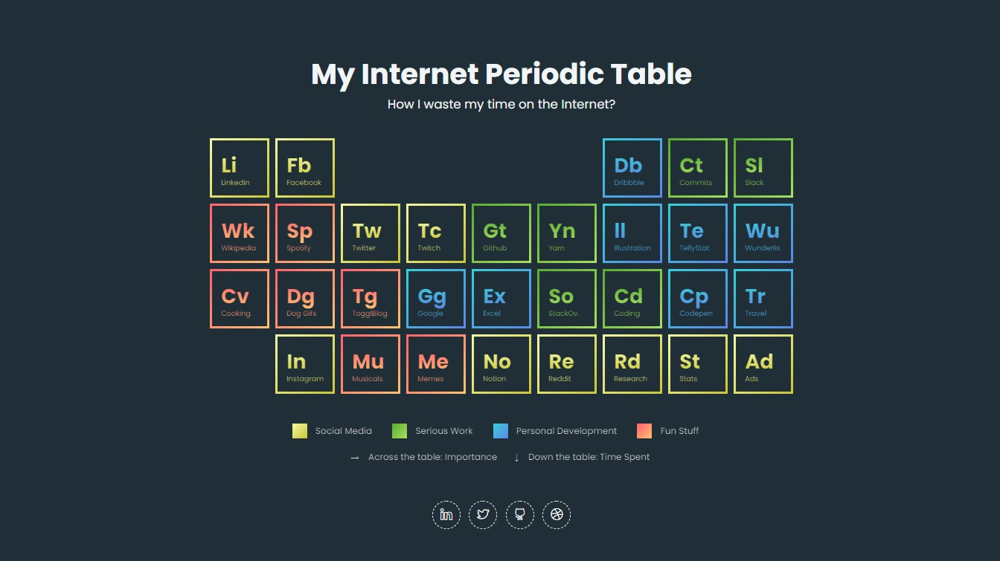
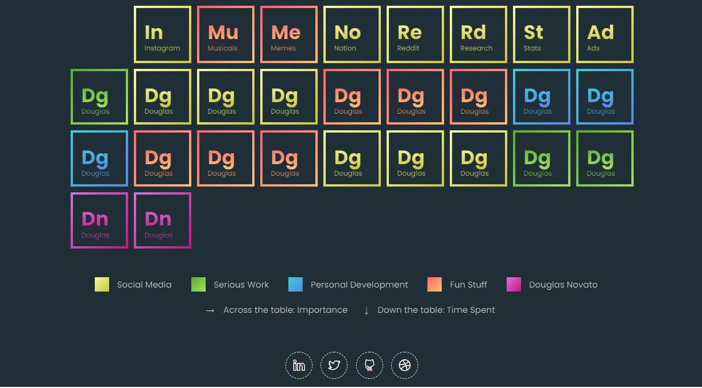
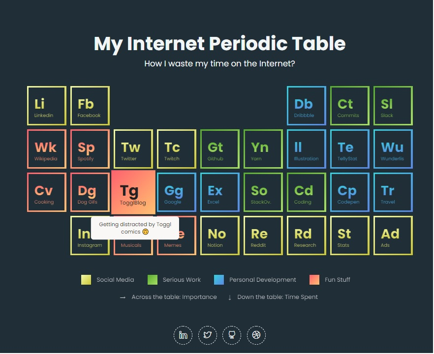
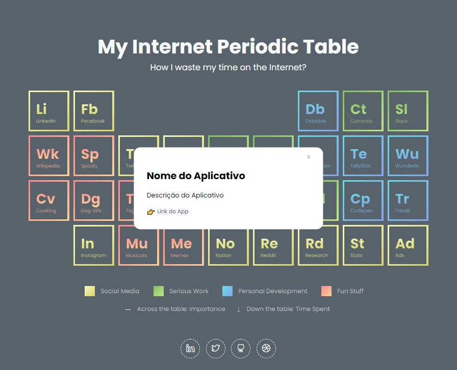

<h4 align="center"> 
	🚧 Tabela Periódica da Internet 🚀
</h4> 

<h1 align="center">
    
</h1>

## 🚀 Descrição do Desafio

Esse desafio é uma forma de conhecer um pouco mais da rotina como programador(a) e a forma de pensar o cotidiano de um Front-End. 

Não será avaliado somente o código, mas também a motivação da solução apresentada, seja ela qual for.

Baseado no arquivo `empresas.json`, deve ser construído uma tabela onde é visualizado alguns sites da internet, separados pelos seguintes grupos: "Social Media", "Serious Work", "Personal Development" e "Fun Stuff". 

A base para a diagramação das informações visualizadas no arquivo json será 
- [Codepen Projeto A](https://codepen.io/oliviale/pen/ZmvPPd)

Exemplos de inspirações de apps criados: 
- [Demo Projeto 1](https://drive.google.com/file/d/1ytAPwfjS1RTQeLs031-NV_DKB7ZsA7KL/view?usp=sharing) 
- [Demo Projeto 2](https://drive.google.com/file/d/1TAYMbZJ1Rt9MoEwWJyQfmkjndmxrLXze/view?usp=sharing)
- [Demo Projeto 3](https://drive.google.com/file/d/1Klq4GgfCZYygFGg8mBMZC_cO1VXo-eWn/view?usp=sharing)

## 🛠 Tecnologias

As seguintes ferramentas foram usadas na construção do projeto:

- [Css][css]: posicionamento, dimensionamento e muito mais
- [Javascript][javascript]: responsividade
- [HTML][html]: estrutura e efeitos 
- [Git][git]: controle de versão e gestão de projetos
- [Github][github]: repositório remoto para compartilharmento de código

### Desafios Principais

- [x] ProDoc101: Criar a tabela baseada no JSON fornecido, primeiramente estaticamente: a função getData() é responsável por fornecer os dados originais. Então, a função main chama a função renderTable passando os dados conforme precisa. A função renderTable manipula o html via DOM para renderizar conforme estilização.
- [x] ProDoc102: Adicionar um efeito de hover que destaque o item da tabela ao passar o mouse sobre ele: recebe um tom forte da color base: efeito hover realizado no css com .table-item:hover e a DOM manipulou em createTableItem.
- [x] ProDoc103: Adicionar um efeito de destacar os itens deste agrupamento, ao clicar em um item na legenda: todos ficam em um tom forte da color base
- [x] ProDoc104: Aplicar estratégias de responsividade, mas sempre mantendo o aspecto de tabela periódica. Ficar flexíveis para caber em 1024px da tela sem distorção. Abaixo desta resolução, deve ser criado uma barra de rolagem ou algo criativo que possa ser utilizado em dispositivos móveis.

### Desafios Extras

- [x] ProDoc201: Ao clicar sobre um elemento, abrir um modal que apresente a informação de descrição. Utilizar a propriedade "Descrição" presente no JSON de referência. 
- [x] ProDoc202: O modal deve fechar ao clicar fora da área de conteúdo, mas o ideal é que seja criado também um botão (X) auxiliar que serve para fechá-lo.
- [ ] ProDoc203: E mais desejável ainda é que ao apertar a tecla ESC, o modal também seja fechado: pesquisando a melhor forma de fazer.
- [ ] ProDoc204: Opções de acessibilidade no teclado como trocar o foco dos itens na tabela ao apertar a tecla tab e acessar o modal apertando as teclas barra de espaço ou enter;
- [x] ProDoc205: Criar um botão na tela que ao clicar, contemple os temas escuro e claro: inserido uma imagem para mudar de tema dark e light
- [ ] ProDoc206: A tabela deve ser dinâmica, caso um novo elemento seja adicionado ao JSON, ele deve ser adicionado visualmente a tabela;
- [ ] ProDoc207: Caso um novo elemento de um novo grupo seja adicionado ao JSON, o efeito de selecionar o grupo na legenda deve contemplar esse novo elemento.

Esse roteiro é apenas um norte de opções para realizar o desafio, mas você está livre para fazer outras coisas. Não se limite em termos de criatividade.  

**"O mais importante para nós, é você ser uma pessoa disposta a aprender do que alguém que já "sabe tudo"."**

#### Meu planejamento

- [x] ProDoc301: Utilizar o git para versionamento e github para gestão de projeto.
- [x] ProDoc302: Publicar a aplicação em um servidor gratuito. Utilizado o netlify: [periodic table on netlify](https://musing-poitras-bf14e7.netlify.app/);
- [x] ProDoc303: Editar ícones e links de redes sociais para meus perfis;
- [ ] ProDoc304: Ter uma prévia descrição quando passa o mouse sobre o elemento; 
- [ ] ProDoc305: Adicionar essa prévia descrição via json;
- [ ] ProDoc306: Salvar a preferência do tema escolhido via localstorage;
- [ ] ProDoc307: html bem elaborado, exemplo: rel="noopener": link aberto com dependência com a página de origem, proteção 
- [ ] ProDoc308: trabalhar persistência do dark e light seguindo as preferências do so: "prefers - css - color - schema", mac magazine
- [ ] ProDoc309: mobile first
- [ ] ProDoc310: off line (mensagem "disponível") 

#### Melhorias

- [ ] ProDoc401: aprender manipular json
- [ ] ProDoc402: posicionar o botão tema
- [ ] ProDoc403: barra de rolagem vertical
- [ ] ProDoc404: cores de textos em modo light
- [ ] ProDoc405: inserir um texto real no modal
- [ ] ProDoc406: inserir logo do app no modal
- [x] ProDoc407: criar issues e tarefas board projects para cada tarefa do desafio

#### Analisar itens de maior complexidade 

1. o css do degradê 
2. o clique para abertura do modal
3. o efeito de seleção conforme o marcar/desmarcar na legenda
4. o posicionamento da tabela ao clicar na legenda 

#### Aprendizado

1. atenção ao prazo e por isso, acompanhar o tempo de resolução de cada uma das tarefas para conseguir cumprir as entregas dentro do planejado
2. diante do problema, pesquisar, rascunhar soluções, tentar resolver, mas caso não conseguir dentro de um prazo, perguntar e buscar orientações de forma inteligente
3. ser objetivo na resolução das tarefas propostas

## 🛠 Versão Final

   
  
  
   
  
   

[git]: https://git-scm.com/doc
[github]: https://docs.github.com/en
[css]: https://developer.mozilla.org/en-US/docs/Web/CSS 
[html]: https://developer.mozilla.org/en-US/docs/Web/HTML
[javascript]: https://developer.mozilla.org/en-US/docs/Web/JavaScript
